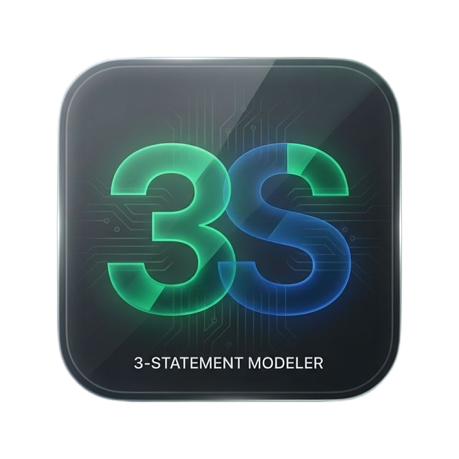

<p align="center">
  
</p>

---

<h1 align="center">Automated 3-Statement Modeler (Desktop)</h1>

A high-performance **Native Desktop Application** that automates the generation of financial statements from raw Trial Balance extracts. Built with **Tauri 2**, **Rust**, **Next.js**, and **FastAPI**.

The **3-Statement Modeler** ingests accounting data, standardizes it through a visual Mapping Engine, and automatically derives a perfectly balanced **Income Statement**, **Balance Sheet**, and **Statement of Cash Flows**. It features a **Live KPI Dashboard** for visual performance tracking, a robust **Forecasting Engine** for scenario-based projections, and professional **PDF/Excel exporting**.

## 🚀 Key Desktop Features

- **Native System Integration**: Lightweight Rust shell with native window controls and system-tray integration.
- **FastAPI Sidecar**: The Python backend runs as a high-performance integrated service.
- **Automatic Resource Management**: The backend lifecycle is managed by the Tauri shell.
- **KPI Dashboards & Data Visualization**: Interactive charts for **Revenue & EBITDA Trajectory**.
- **Account Mapping Engine**: Intuitive UI to link raw accounts to the Master Chart of Accounts.

## 🛠️ Tech Stack

| Layer | Technologies |
|---|---|
| **Desktop Shell** | **Tauri 2 (Rust)** |
| **Frontend** | Next.js 16, React, TypeScript, Tailwind CSS, Lucide |
| **Backend Service** | **FastAPI (Python 3.12)**, PyInstaller (Sidecar) |
| **Database** | SQLite (`threestatement.db`) |

## 🚦 Getting Started (Linux/Arch)

### Prerequisites
- Node.js v19+
- Python 3.12+
- Rust / Cargo (for development)

### 🚀 1-Click Installation
For Arch Linux users, the project includes a native installer script:

```bash
# Build the entire pipeline and install locally
./install-arch.sh
```

### 🛠️ Development Mode
To run the project with live-reloading for both the frontend and the Rust shell:

```bash
# Install dependencies first
cd frontend && npm install
cd ../backend && python -m venv .venv && source .venv/bin/activate && pip install -r requirements.txt

# Start the Tauri dev environment
cargo tauri dev
```

## 📂 Repository Structure

```text
.
├── assets             # Branding assets and master logos
├── backend            # Python FastAPI service (Sidecar source)
├── frontend           # Next.js 16 Web UI
├── tauri              # Rust Desktop Shell (Tauri 2 config)
├── PKGBUILD           # Native Arch Linux package definition
├── build.sh           # Main cross-layer build pipeline
├── install-arch.sh    # Helper script for Linux installation
└── README.md          # Project documentation
```

## 🤝 Contributing

Contributions are welcome! Please feel free to submit a Pull Request.
